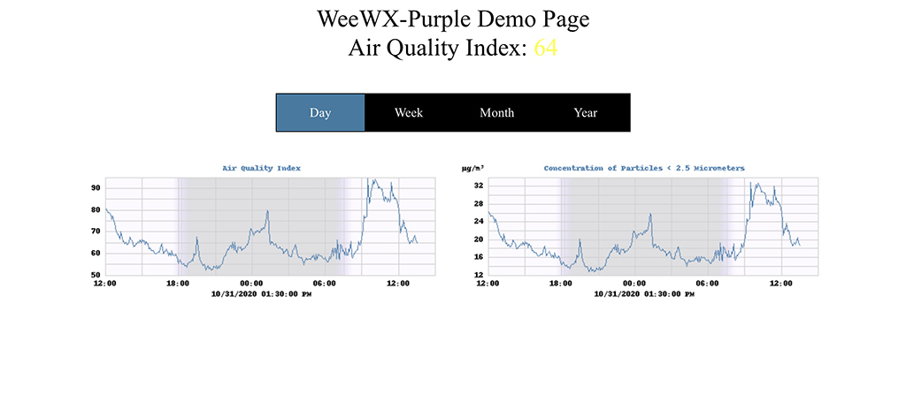

# weewx-purple
*Open source plugin for WeeWX software.

## Description

A WeeWX plugin that gets its PurpleAir sensor readings either directly
from the PurpleAir sensor or from a
[purple-proxy](https://github.com/chaunceygardiner/weewx-purple) service.

Copyright (C)2020 by John A Kline (john@johnkline.com)

**This plugin requires Python 3.7, WeeWX 4 and the
[wview_extended](https://github.com/weewx/weewx/blob/master/bin/schemas/wview_extended.py)
schema**

weewx-purple requires the
[wview_extended](https://github.com/weewx/weewx/blob/master/bin/schemas/wview_extended.py)
in WeeWX 4 that contains pm1_0, pm2_5 and pm10_0 columns.  With the weewx-purple
extension, Loop records will be populated with pm1_0, pm2_5 and pm10_0 fields that
correspond to PurpleAir's pm1_0_cf_1, pm2_5_cf_1 and pm10_cf_1 fields.

Note: As of v3.0, this extension always applies the US EPA correction for PM2.5.  See:
   (https://cfpub.epa.gov/si/si_public_file_download.cfm?p_download_id=539905&Lab=CEMM)
   The LRAPA and UNBC corrections have been removed (as well as the uncorrected
   PM2.5 value).

As of v3.0, the uncorrected PM2.5 concentration is no longer available.
The LRAPA and UNBC corrections have also been removed.

The reason for this change is that the EPA correction needs the
temperature and humidity as reported by the sensor.  These values
are not saved by the extension, so it is not possible to construct
the EPA corrected concentration later.  The extension could find an
unused column in the schema to store the PurpleAir's temperature and
humidity, but the author has deemed this more trouble than it is
worth.  If the user doesn't like this change, please continue to
use the 0.1 version of this extension.

Please note that the value stored as PM2.5 (i.e., the EPA corrected
value) is much better than the raw value, the LRAPA value and the
UNBC value.  The EPA corrected concentration has been shown to
result in the correct US EPA AQI category 92% of the time and only
one off from the correct category 100% of the time.  This was
true for all regions in the study (throughout the USA) and for
all conditions (including wildfire smoke).

In addition to pm1_0, pm2_5 and pm10_0, AQI variables are also available
(even though they are not in the database) via WeeWX 4's
[XTypes](https://github.com/weewx/weewx/wiki/WeeWX-V4-user-defined-types).
pm2_5_aqi is automatically computed from pm2_5 and can be used in reports
(`$current.pm2_5_aqi`) and in graphs `[[[[pm2_5_aqi]]]`.  Also available is
is the [RGBint](https://www.shodor.org/stella2java/rgbint.html) value
`pm2_5_aqi_color` (useful for displaying AQI in the appropriate color
(e.g., green for AQIs <= 50).

If the sensor is an outdoor sensor, the fields inserted are the averages
of the two sensors.

Earlier versions of purple-proxy wrote to a separate database.  This is no
longer the case.

A skin is provided to show a sample report:


### What's a purple proxy?

purple-proxy is optional when using weewx-purple.  purple-proxy
returns an average over the archive period when queried.  Use of purple-proxy
is not recommended (and strongly discouraged for all but the most Unix/Linux
savy.  The install is rather crude and has only been tested on Debian.
If in doubt, skip purple-proxy and query the PurpleAir devices directly.

See `weewx-purple` and `purple-proxy` in action on the following pages:
* [Weatherboard&trade; Report](https://www.paloaltoweather.com/weatherboard/)
* [LiveSeasons Report](https://www.paloaltoweather.com/index.html).

# Installation Instructions

If you don't meet the following requirements, don't install this extension.
  * WeeWX 4
  * Using WeeWX 4's new wview_extended schema.
  * Python 3.7 or greater

1. Download the lastest release, weewx-purple-3.0.1.zip, from the
   [GitHub Repository](https://github.com/chaunceygardiner/weewx-purple).

1. Run the following command.

   `sudo /home/weewx/bin/wee_extension --install weewx-purple-3.0.1.zip`

   Note: this command assumes weewx is installed in /home/weewx.  If it's installed
   elsewhere, adjust the path of wee_extension accordingly.

1. Edit the `Purple` section of weewx.conf (which was created by the install
   above).  PurpleAir sensors are specified with section names of `Sensor1`,
   `Sensor2`, `Sensor3`, etc.  Proxies are specified as `Proxy1`, `Proxy2`,
   `Proxy3`, etc.  There is no limit on how many sensors and proxies can
   be configured; but the numbering must be sonsecutive.  The order in which
   sensors/proxies are interrogated is first the proxies, low numbers to high;
   then the sensors, low numbers to high.  Once a proxy or sensor replies,
   no further proxies/sensors are interrogated for the current polling round.

   ```
   [Purple]
       [[Sensor]]
           enable = true
           hostname = purple-air
           port = 80
           timeout = 15
       [[Sensor2]]
           enable = false
           hostname = purple-air2
           port = 80
           timeout = 15
       [[Proxy1]]
           enable = false
           hostname = proxy
           port = 8000
           timeout = 5
           starup_timeout = 60
       [[Proxy2]]
           enable = false
           hostname = proxy2
           port = 8000
           timeout = 5
           starup_timeout = 60
       [[Proxy3]]
           enable = false
           hostname = proxy3
           port = 8000
           timeout = 5
           starup_timeout = 60
       [[Proxy4]]
           enable = false
           hostname = proxy4
           port = 8000
           timeout = 5
           starup_timeout = 60
   ```

1. If you are Unix/Linux savy, and are willing to work with a crude
   installation procedure, install
   [purple-proxy](https://github.com/chaunceygardiner/purple-proxy).

1. Restart WeeWX

1. To check for a successful install, wait for a reporting cycle, then
   navigate in a browser to the WeeWX site and add /purple to the end
   of the URL (e.g., http://weewx-machine/weewx/purple).
   The PM2.5 and AQI graphs will fill in over time.

# How to access weewx-purple fields in reports.

Detailed instructions are pending, below is a quick and dirty set of instructions.
At present, one will need to browse the code for more detail.

Note: Although the examples below show the use of $current, aggregates are also
supported (e.g., the high PM2.5 for the week can be presented with `$week.pm2_5.max`.

To show the PM2.5 reading, use the following:
```
$current.pm2_5
```

To show the Air Quality Index:
```
$current.pm2_5_aqi
```

To get the RGBINT color of the current Air Quality Index:
```
#set $color = int($current.pm2_5_aqi_color.raw)
#set $blue  =  $color & 255
#set $green = ($color >> 8) & 255
#set $red   = ($color >> 16) & 255
```

To show the PM1.0 reading, use the following:
```
$current.pm1_0
```

To show the PM10.0 reading, use the following:
```
$current.pm10_0
```

## Licensing

weewx-purple is licensed under the GNU Public License v3.
