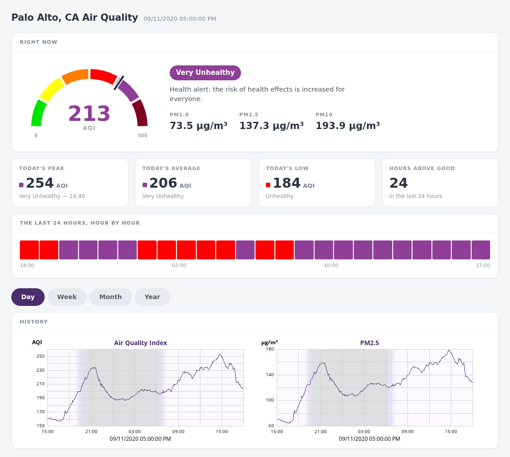
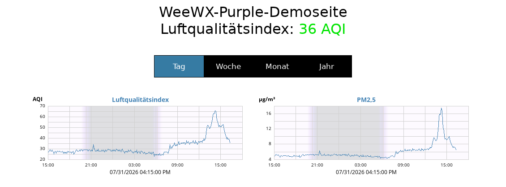

# weewx-purple — Know what you're breathing
Open source plugin for WeeWX software.

Copyright (C) 2020-2026 by John A Kline (john@johnkline.com)

[](https://chaunceygardiner.github.io/weewx-purple/)
[](https://github.com/chaunceygardiner/weewx-purple/releases/latest/download/weewx-purple.zip)
[](https://github.com/chaunceygardiner/weewx-purple/issues)

## What it is

weewx-purple puts the air over your own station on your WeeWX site: how much
smoke and dust is in it **right now**, and what the EPA would call it.

PM1.0, PM2.5 and PM10 land in every loop packet and every archive record, so
air quality graphs sit alongside temperature and rain, and the current AQI —
with its official EPA color — is available anywhere in your reports and
templates.  The PM2.5 that gets stored is EPA-corrected, not the raw laser
count, so the number on your page is the number the agencies would publish.
When the smoke rolls in, you are reading your own backyard, not a regional
monitor miles upwind.

**Downtime leaves no hole.**  A restart, a reboot, a power cut: weewx-purple
goes back and fills the pm data into the records WeeWX missed (this needs the
author's [purple-proxy](https://chaunceygardiner.github.io/purple-proxy/)), so
nothing is left blank in the columns or in the graphs that draw them.  The
catch-up records your logger hands over when WeeWX returns carry no air
quality data of their own — nothing was running to supply any.  See
[Filling gaps after downtime](#filling-gaps-after-downtime).



*Shown on 09/11/2020, the day wildfire smoke turned the Bay Area sky
orange.  Most days are green; this is the one the colors are for.*

**Requires:**
* WeeWX 4.6 or later
* Python 3.7 or greater
* The [wview_extended](https://github.com/weewx/weewx/blob/master/src/schemas/wview_extended.py)
  schema (it contains the `pm1_0`, `pm2_5` and `pm10_0` columns)
* The `python-dateutil` and `requests` Python packages
* A PurpleAir sensor reachable on your local network
* Recommended: a [purple-proxy](https://chaunceygardiner.github.io/purple-proxy/)
  polling that sensor.  Filling gaps after downtime requires one; everything
  else works without it.

Not sure about the schema?  wview_extended is the default for new WeeWX 4
and 5 installs; only databases created under WeeWX 3 and carried forward
still use the old schema.  To check, look for `pm2_5` in your archive
table, e.g.:

```
echo '.schema archive' | sqlite3 /var/lib/weewx/weewx.sdb | grep pm2_5
```

## The fields it adds

Every loop packet is populated with:

| Field     | Contents                                                              |
|-----------|-----------------------------------------------------------------------|
| `pm1_0`   | PM1.0 concentration (µg/m³), average of the A and B channels          |
| `pm2_5`   | PM2.5 concentration (µg/m³) with the US EPA correction applied        |
| `pm10_0`  | PM10 concentration (µg/m³), average of the A and B channels           |

Two more observation types are available everywhere in reports and graphs —
without being stored in the database — via WeeWX
[XTypes](https://github.com/weewx/weewx/wiki/WeeWX-V4-user-defined-types):

| Field              | Contents                                                       |
|--------------------|----------------------------------------------------------------|
| `pm2_5_aqi`        | US EPA Air Quality Index computed from `pm2_5` (2024 definition) |
| `pm2_5_aqi_color`  | The RGB color of the AQI category, as a single integer         |

On outdoor (dual-laser) sensors, readings are sanity checked: a reading is
rejected if the A and B channels disagree wildly, if fields are missing or
non-numeric, or if the reading is stale.  If multiple sensors/proxies are
configured, they are tried in order until one produces a good reading.

No extra database configuration is needed: WeeWX automatically accumulates
the loop values into each archive record, so `pm1_0`, `pm2_5` and `pm10_0`
land in the database (and in history graphs) on their own.

Gaps left by downtime are filled in as well.  The missing `pm1_0`, `pm2_5`
and `pm10_0` are fetched from a
[purple-proxy](https://chaunceygardiner.github.io/purple-proxy/)'s own archive
history, so a proxy is what makes this possible; with only direct sensors
configured there is nothing to ask.  The `pm2_5` written is the same
EPA-corrected value the live path stores.  See
[Filling gaps after downtime](#filling-gaps-after-downtime) and
[What's purple-proxy?](#whats-purple-proxy).

### The EPA correction

The stored `pm2_5` value is always the
[2021 US EPA correction](https://www.epa.gov/sites/default/files/2021-05/documents/toolsresourceswebinar_purpleairsmoke_210519b.pdf)
computed from the raw `cf_1` readings of both channels plus the temperature
and humidity reported by the sensor:

```
low  (PAcf_1 <= 343 µg/m³): PM2.5 = 0.52*PAcf_1 - 0.086*RH + 5.75
high (PAcf_1  > 343 µg/m³): PM2.5 = 0.46*PAcf_1 + 3.93e-4*PAcf_1² + 2.97
```

The correction has been shown to yield the correct US EPA AQI category 92% of
the time, and to be at most one category off 100% of the time, across all US
regions and all conditions (including wildfire smoke).  The uncorrected PM2.5
is deliberately not stored: the correction requires the sensor's temperature
and humidity, which are not saved, so it could not be recomputed later.

### AQI categories

`pm2_5_aqi` conforms to the
[2024 EPA AQI definition](https://www.epa.gov/system/files/documents/2024-02/pm-naaqs-air-quality-index-fact-sheet.pdf);
`pm2_5_aqi_color` uses the EPA-defined RGB colors:

| Category                       | AQI       | 24-hr PM2.5 (µg/m³) | Color  | RGB           |
|--------------------------------|-----------|---------------------|--------|---------------|
| Good                           | 0 - 50    | 0.0 - 9.0           | Green  | (0, 228, 0)   |
| Moderate                       | 51 - 100  | 9.1 - 35.4          | Yellow | (255, 255, 0) |
| Unhealthy for Sensitive Groups | 101 - 150 | 35.5 - 55.4         | Orange | (255, 126, 0) |
| Unhealthy                      | 151 - 200 | 55.5 - 125.4        | Red    | (255, 0, 0)   |
| Very Unhealthy                 | 201 - 300 | 125.5 - 225.4       | Purple | (143, 63, 151)|
| Hazardous                      | 301 - 500 | 225.5 - 325.4       | Maroon | (126, 0, 35)  |

Concentrations above 325.4 µg/m³ map to AQI values above 500, continuing on
the same slope as AQI 301-500 (per the May 2024
[AirNow Technical Assistance Document](https://document.airnow.gov/technical-assistance-document-for-the-reporting-of-daily-air-quailty.pdf)).
The category and color remain Hazardous/Maroon.

### Sample report

A small sample report is installed at `<HTML_ROOT>/purple` — the page shown at
the top of this README.  It is meant to be usable as it stands, not just
looked at: it takes its heading and browser title from your `[Station]`
`location`, so it reads *Palo Alto, CA Air Quality* rather than naming this
extension.  It leads with the current AQI on a dial of the six
US EPA categories, the category it falls in and that category's health
advice, and all three particulate sizes; then the day's peak, average and
low, and a cell per hour for the last twenty-four, each colored by its
category, so a smoke day is legible at a glance.  The four period plots are
behind the Day/Week/Month/Year tabs at the foot of the page.

It is translatable and ships German, French, Dutch and Spanish (see
[Translations](#translations)); in German it looks like this:



### Translations

The sample report is translatable through WeeWX's own mechanisms — lang files
and gettext-style `[Texts]` keys (the English string is the key; a missing
entry falls back to English one string at a time).  German, French, Dutch and
Spanish ship (`skins/purple/lang/de.conf`, `fr.conf`, `nl.conf`, `es.conf`;
corrections welcome — [file an
issue](https://github.com/chaunceygardiner/weewx-purple/issues)); select one
per report in `weewx.conf`:

```
[StdReport]
    [[PurpleReport]]
        lang = de                # or fr, nl, or es
```

`[StdReport] [[Defaults]] lang = de` instead switches every skin that ships
German at once; a skin lacking the language is a logged no-op, not an error.
To add a language, copy `skins/purple/lang/en.conf` — the reference
dictionary, kept exact by a test — and translate the values.

### What's purple-proxy?

[purple-proxy](https://chaunceygardiner.github.io/purple-proxy/) is a small service that polls the sensor
for you and keeps its own archive of the readings.  Running one is recommended, for three reasons:

* **It spares the sensor.**  A PurpleAir's processor is easily overwhelmed,
  and everything that queries it competes for the same small budget.  The
  proxy queries the sensor at one steady rate and answers everyone else.
* **It serves an average, not a spot reading.**  Each value it returns is
  an average of the last two minutes, and each record it archives is an
  average of that whole archive period.
* **It fills the gaps.**  Because the proxy keeps archive records of its
  own, weewx-purple can go back and fill in the air quality data for the
  periods WeeWX was down for.  Nothing else can: a sensor queried directly
  keeps no history, so those records stay empty forever.

Two proxies on different machines can poll the same sensor for redundancy,
and weewx-purple will try each configured proxy in turn.  The install is a
script (`sudo ./install`) and has been tested on Debian and Raspberry Pi OS;
on other platforms it serves as a specification of the steps needed.

See weewx-purple in action:
* [Weatherboard&trade; Report](https://www.paloaltoweather.com/weatherboard/)
* [LiveSeasons Report](https://www.paloaltoweather.com/index.html)

# Installation

1. Find your sensor on the network and verify you can reach it.

   Find the sensor's IP address (e.g., in your router's DHCP client list,
   or in the PurpleAir registration email), then browse to
   `http://<sensor-ip>/json`.  You should see a page of JSON sensor data —
   that is exactly the endpoint this extension polls.  Since the extension
   needs a stable address, give the sensor a DHCP reservation in your
   router (or a hostname in local DNS) so its address doesn't change.

1. Optional but recommended: set up a
   [purple-proxy](https://chaunceygardiner.github.io/purple-proxy/) to poll the sensor, following its
   [installation instructions](https://chaunceygardiner.github.io/purple-proxy/installation).  It spares the sensor's processor,
   serves averages rather than spot readings, and is what lets this
   extension fill in the air quality data for archive periods WeeWX was not
   running for.  Set its `archive-interval-secs` to match WeeWX's archive
   interval.

1. Install the prerequisite Python packages.

   For a WeeWX pip install, activate WeeWX's virtual environment first, then:

   ```
   pip install python-dateutil requests
   ```

   For a Debian package install of WeeWX:

   ```
   apt install python3-dateutil python3-requests
   ```

1. Download the latest release, `weewx-purple.zip`, from the
   [GitHub repository](https://github.com/chaunceygardiner/weewx-purple).

1. Install the extension and restart WeeWX.

   WeeWX 5, pip install (`weectl` lives in the virtual environment, so
   activate it first; yours may sit elsewhere, `~/weewx-venv` is the usual
   place):

   ```
   source ~/weewx-venv/bin/activate
   weectl extension install weewx-purple.zip
   ```

   WeeWX 5, Debian or Red Hat package install (`weectl` is already on the
   path).  No `sudo`: that install put your account in the `weewx` group,
   which owns the files -- if you installed WeeWX in this same login
   session, log out and back in first so the group membership takes
   effect.

   ```
   weectl extension install weewx-purple.zip
   ```

   WeeWX 4 (on a setup.py install use the full path, e.g.
   `/home/weewx/bin/wee_extension`; a package install has it on the path):

   ```
   sudo wee_extension --install weewx-purple.zip
   ```

1. Edit the `[Purple]` section of weewx.conf (created by the install) to
   point at your sensor, then restart WeeWX.

1. To check the install, wait for a reporting cycle, then browse to the WeeWX
   site with `/purple` appended to the URL
   (e.g., `http://weewx-machine/weewx/purple`).  The PM2.5 and AQI graphs
   fill in over time.

## Configuration

```
[Purple]
    # How often to poll the sensor in seconds
    #poll_secs = 15
    [[Sensor1]]
        enable = true
        # The port the sensor's own web server listens on
        #port = 80
        # http timeout (seconds)
        #timeout = 15
        # PLACEHOLDER -- replace with the host name or IP address of
        # the first sensor
        hostname = purple-air
    [[Sensor2]]
        enable = false
        #port = 80
        #timeout = 15
        hostname = purple-air2
    [[Proxy1]]
        enable = false
        #port = 8000
        #timeout = 1
        hostname = proxy1
```

The options the install writes commented out are the ones weewx-purple
supplies for itself.  Leave one commented and the extension's own value
governs, including a better one a later release might bring; uncomment it to
pin this station to the value shown.  `hostname` is written live because
there is nothing to fall back on -- it is the one you have to replace with
your own.  `enable` is written live for a different reason: `Sensor1` ships
enabled so that a fresh install works with no proxy, and that is not what an
absent `enable` means.  Leave `enable` out of a section and that source is
simply off.

| Option      | Default              | Meaning                                          |
|-------------|----------------------|--------------------------------------------------|
| `poll_secs` | 15                   | How often to poll for a new reading (seconds)    |
| `enable`    | false                | Whether this source is polled                    |
| `hostname`  |                      | Hostname or IP address of the sensor/proxy       |
| `port`      | 80 (sensor) / 8000 (proxy) | Port to connect on                         |
| `timeout`   | 1 (proxy) / 15 (sensor) | HTTP timeout (seconds).  A proxy answers from its own database on the local network, so a second is ample; a sensor's own processor is slow and easily overwhelmed, so it gets more room. |

PurpleAir sensors are specified with subsections `[[Sensor1]]`, `[[Sensor2]]`,
etc.; purple-proxy services with `[[Proxy1]]`, `[[Proxy2]]`, etc.  There is no
limit on the number of sensors and proxies, but the numbering of each group
must start at 1 and be consecutive (a gap ends the scan).  On each polling
round, proxies are interrogated first (low numbers to high), then sensors;
the first source that yields a sane, fresh reading wins and no further
sources are tried.

A reading is considered fresh for `max(120, 3 * poll_secs)` seconds; stale
readings are never inserted into loop packets.

## Filling gaps after downtime

If at least one `[[ProxyN]]` source is enabled, weewx-purple also fills in
air quality data for the archive periods WeeWX itself was not running for.
When WeeWX starts, the station's logger hands over the records it kept while
WeeWX was down; those records contain no `pm1_0`, `pm2_5` or `pm10_0`,
because nothing was there to supply them.  For each such record, the proxies
are asked — in configured order — for the archive records covering that
period, and the average is written into the record before WeeWX stores it.
The `pm2_5` written is the same US EPA corrected value the live path stores.

**Set purple-proxy's `archive-interval-secs` to match WeeWX's archive
interval.**  WeeWX logs the interval it is using at startup (`Using archive
interval of 300 seconds`), and weewx-purple logs the same number
(`archive_interval: 300`).  With the two matched, each proxy record lines up
exactly with one WeeWX period.  A proxy that archives more often is handled —
its records for the period are averaged — but a proxy that archives *less*
often than WeeWX has no record to offer for most periods, and those go
unfilled.

Periods WeeWX did see are never touched: whatever WeeWX averaged from the
loop packets stands.

A proxy normally has the record for the period that has only just closed: its
polls are aligned to the clock, so one lands on the archive boundary and the
record is written a second or two later — before WeeWX archives that period
at all.  When no proxy has it — a proxy running with a `poll-freq-offset` can
still be a few seconds behind, and one that was down for the period has
nothing — the proxy's current reading (an average of the last two minutes)
stands in, but only while the period is still inside those two minutes.  Any
period further back that no proxy can answer for is left alone: an empty pm
column is the honest answer, and better than a value that describes some
other stretch of time.

With no proxy configured, none of this happens.  A sensor queried directly
keeps no history, so there is nothing to ask for, and the pm columns for
those periods stay empty.

Two log messages come from this, one per archive record:

```
INFO user.purple: Backfilled pm1_0, pm2_5, pm10_0 into archive record 2026-08-26 18:40:00 PDT (1787794800).
INFO user.purple: No proxy data with which to fill pm1_0, pm2_5, pm10_0 in archive record ...
```

The second is also how a proxy that is down announces itself, once per
archive period, for as long as it stays down.


# Using weewx-purple fields in reports

Current values:

```
$current.pm1_0
$current.pm2_5
$current.pm10_0
$current.pm2_5_aqi
$current.pm2_5_aqi_color
```

Aggregates work for both the database-backed fields and the AQI xtypes.
The xtype itself implements `avg`, `min`, `max`, `first`, `last` and
`count`, and serves spans covering whole days out of the `pm2_5` daily
summaries:

```
$day.pm2_5.max
$week.pm2_5.avg
$day.pm2_5_aqi.max
```

Ask for any other aggregate — `maxtime`, `mintime`, `sum` — and WeeWX falls
through to its own generic handler, which walks the span record by record
converting each one.  That does work, but it reads every archive row
instead of the daily summaries, and it raises `UnknownAggregation` if any
record in the span has a NULL `pm2_5` — which is exactly what an outage
leaves behind.

For the *time* of a peak, use `pm2_5` rather than the xtype.  AQI is a
non-decreasing function of PM2.5, so the moment the AQI peaked is the
moment `pm2_5` peaked, and `pm2_5` is a real column whose `maxtime` comes
straight off the daily summary:

```
$day.pm2_5_aqi.max at $day.pm2_5.maxtime
```

Both `pm2_5_aqi` and `pm2_5_aqi_color` can also be graphed, e.g. in
skin.conf's `[ImageGenerator]` section:

```
        [[[dayaqi]]]
            [[[[pm2_5_aqi]]]]
```

`pm2_5_aqi_color` is an [RGBint](https://www.shodor.org/stella2java/rgbint.html)
value, useful for displaying the AQI in the color of its category.  To unpack
it in a Cheetah template:

```
#set $color = int($current.pm2_5_aqi_color.raw)
#set $blue  =  $color & 255
#set $green = ($color >> 8) & 255
#set $red   = ($color >> 16) & 255
```

## How AQI values are computed (and stored)

AQI is always computed on demand from the stored `pm2_5` concentration —
there is no AQI column in the database, and none is needed: `$current`,
aggregates and graphs all resolve through the extension's AQI xtype.  For
real-time consumers (e.g., MQTT), `pm2_5_aqi` and `pm2_5_aqi_color` are
also present in every LOOP packet.

There is no performance reason to store AQI (or its color) either, even
for long-term plots.  For an aggregated plot (e.g., a month of daily
maxima) the database aggregates the stored `pm2_5` exactly as it would
aggregate a stored AQI column, and the conversion to AQI and color — a
single interpolation and a category lookup — runs once per plotted
point, not once per database row; spans covering whole days are served
from the `pm2_5` daily-summary table without scanning the archive at
all.  Converting after aggregation is also the EPA-correct order of
operations: AQI is a non-linear transform of concentration, so the
average of per-record AQI values is not the AQI of the average
concentration (and an averaged RGB color can belong to no EPA category
at all).

To keep the on-demand computation authoritative, the extension registers
`extractor = noop` for both AQI fields so that WeeWX's accumulator does
not average them into archive records (averaging AQI values is
meaningless, since AQI is a non-linear transform of concentration).  An
`[Accumulator]` section in weewx.conf takes precedence if you
deliberately want different behavior.

### If you added an AQI column to your database

Some users have added a `pm2_5_aqi` (or `pm2_5_aqi_color`) column to their
database schema.  As of 5.0.1 the accumulator no longer fills such a
column, and any values stored in it *before* 5.0.1 are accumulator
averages that disagree with what the xtype computes (non-integer, and
averaged across a non-linear transform).  While present, those stored
values also override the xtype for `$current`.

**The cleanest fix is to remove the column.**  With WeeWX stopped (for a
pip install, activate WeeWX's virtual environment first):

WeeWX 5:

```
weectl database drop-columns pm2_5_aqi
```

WeeWX 4 (adjust the path if WeeWX is not installed in /home/weewx):

```
sudo /home/weewx/bin/wee_database --drop-columns=pm2_5_aqi
```

Name exactly the column(s) you added (repeat for `pm2_5_aqi_color` if you
added that too — naming a column that doesn't exist aborts the whole
command).  This also removes the matching daily-summary table.  Restart
WeeWX; no configuration changes are needed — `$current`, aggregates and
graphs all resolve through the xtype again.

**If something outside WeeWX reads the column directly** (e.g., Grafana),
keep it and have WeeWX compute it through the xtype, which stores
correctly EPA-rounded values:

```
[StdWXCalculate]
    [[Calculations]]
        pm2_5_aqi = prefer_hardware
        pm2_5_aqi_color = prefer_hardware
```

Then purge any values stored before 5.0.1 and backfill them through the
xtype:

1. Add the `[StdWXCalculate]` entries above to weewx.conf.

1. Stop WeeWX and back up the database.

1. NULL out the old values — for each AQI column you added, e.g. with
   SQLite (adapt for MySQL):

   ```
   sqlite3 /path/to/archive.sdb "UPDATE archive SET pm2_5_aqi = NULL;"
   ```

1. Backfill.  WeeWX 5: `weectl database calc-missing`; WeeWX 4:
   `wee_database --calc-missing`.  This recomputes each NULLed value from
   that record's stored `pm2_5` and recalculates the daily summaries.
   (It loads the extension to get the AQI xtype, so expect Purple's
   startup log lines, including a sensor fetch.)

1. Restart WeeWX.

# Troubleshooting

* `Purple extension is inoperable` in the log: no source has `enable = true`
  in `[Purple]`.
* `Found no fresh concentrations to insert.`: the sensor has stopped
  answering (or is answering with insane readings).  Logged once per outage;
  `Fresh concentrations available again.` is logged on recovery.
* `purpleair reading from <host> not sane, ...`: the reason and the offending
  reading are included in the message.
* `Backfilled pm1_0, pm2_5, pm10_0 into archive record <time>`: an archive
  period WeeWX was not running for has had its air quality data filled in
  from a proxy's archive history.  Expect one line per record after an
  outage.
* `No proxy data with which to fill ... in archive record <time>`: no
  configured proxy could answer for that period, so its pm columns were left
  empty.  Logged once per archive record, which is also how a proxy that is
  down makes itself heard for as long as it stays down.
* **The sample report shows the top card but no tiles or hourly strip.**  Those
  need at least one PM2.5 reading recorded for the current day: they are
  absent between midnight and the first archive record, and stay absent for
  as long as the sensor has been unreachable since midnight.  They reappear
  on the report cycle after a reading lands.
* **The pm columns are empty for a stretch of time.**  WeeWX was not running
  then, and the periods were filled only if a proxy could answer for them —
  see [Filling gaps after downtime](#filling-gaps-after-downtime).
  With no `[[ProxyN]]` configured nothing is filled, and the log says
  nothing about it.  With one configured, look for `Backfilled ...` or `No
  proxy data with which to fill ...` at the time WeeWX restarted.
* To watch what the collector sees, run the module directly against a sensor:

  ```
  PYTHONPATH=<weewx-bin-dir> python bin/user/purple.py --test-collector --hostname <sensor> [--port <port>]
  ```

# Running the test suite

The tests are hermetic (no sensor or network required).  From a Python
environment with WeeWX installed:

```
PYTHONPATH=bin python -m pytest tests
```

## Licensing

weewx-purple is licensed under the GNU Public License v3.
